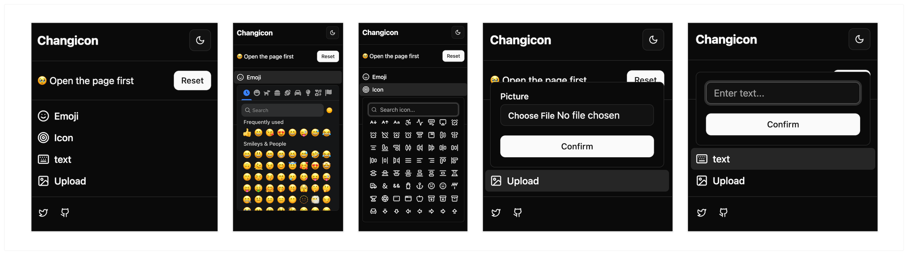

# Website (Tab) Icon Customizer

A simple yet powerful Chrome extension that allows you to customize website (browser tab) icons . Built with WXT + React + shadcn/ui + Tailwindcss.




## ✨ Features
🎨 Custom Tab Icons
- Text icons (up to 2 characters)
- Emoji icons
- Custom image upload
- SVG icon support

💅 Beautiful Icon Style
- Rounded rectangle design
- White background
- Perfect padding

🚀 Easy to Use
- Click extension icon to modify
- Real-time preview
- Auto-save settings

## 🛠️ Development

### Prerequisites

- Node.js >= 20
- pnpm >= 10

### Installation

```bash
pnpm install
```

### Development Mode

```bash
npm run dev
```

### Build

```bash
npm run build
```

## 📦 Installation

### Webstore
Open the [Changeicon](https://chromewebstore.google.com) directly, or go to [chromewebstore](https://chromewebstore.google.com) and serarch 'changicon'.

### Manual install
1. `npm run build`
2. Open Chrome Extensions page (`chrome://extensions/`)
3. Enable "Developer mode"
4. Click "Load unpacked"
5. Select the `.output/chrome-mv3` directory of this project

## 🤝 Contributing

Issues and Pull Requests are welcome!

## 📝 License

[MIT License](LICENSE)
